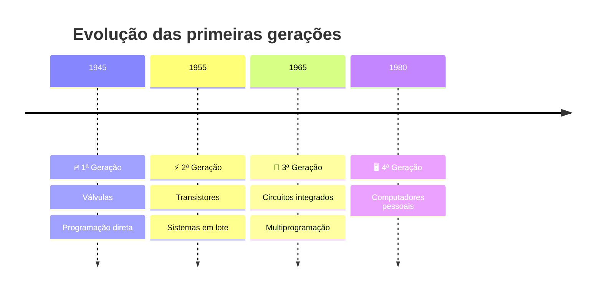
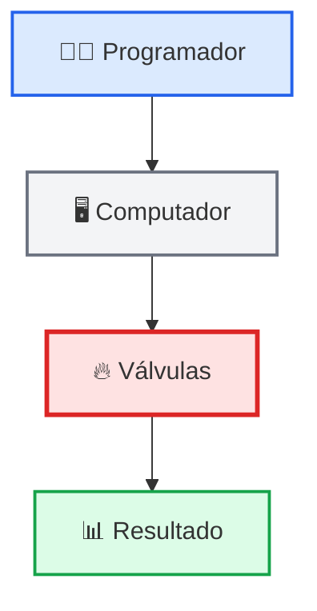
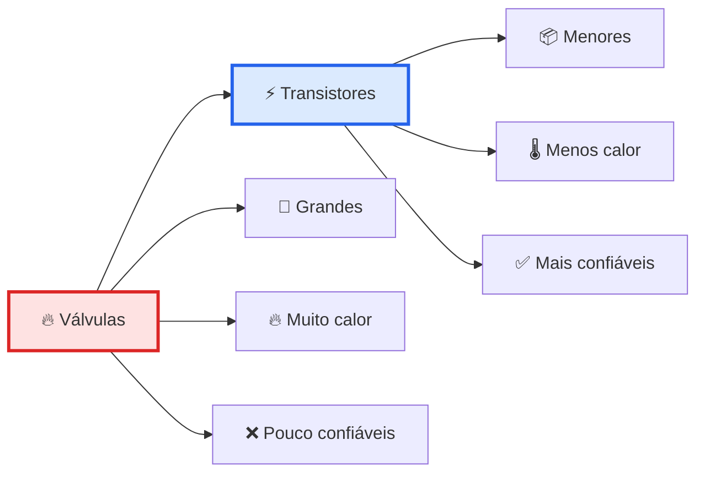
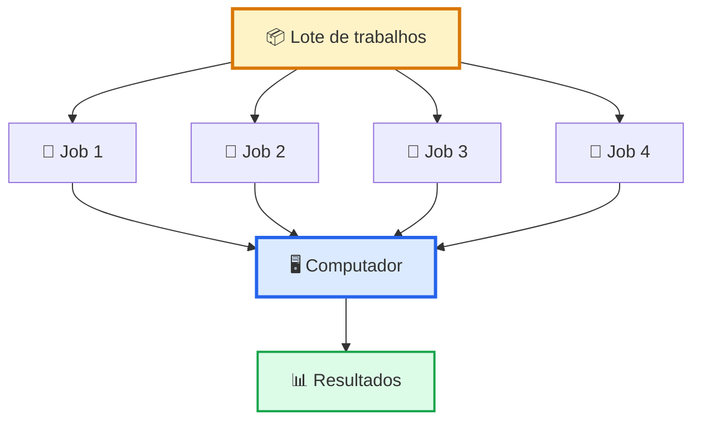
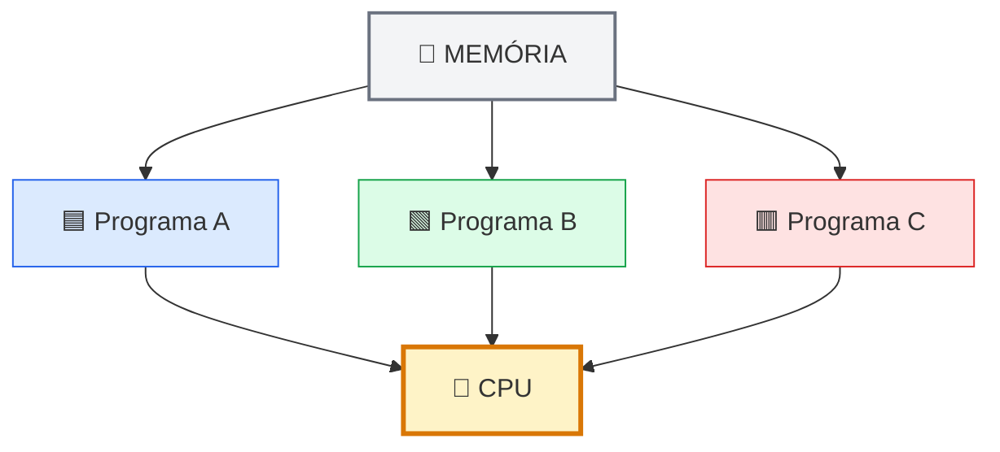
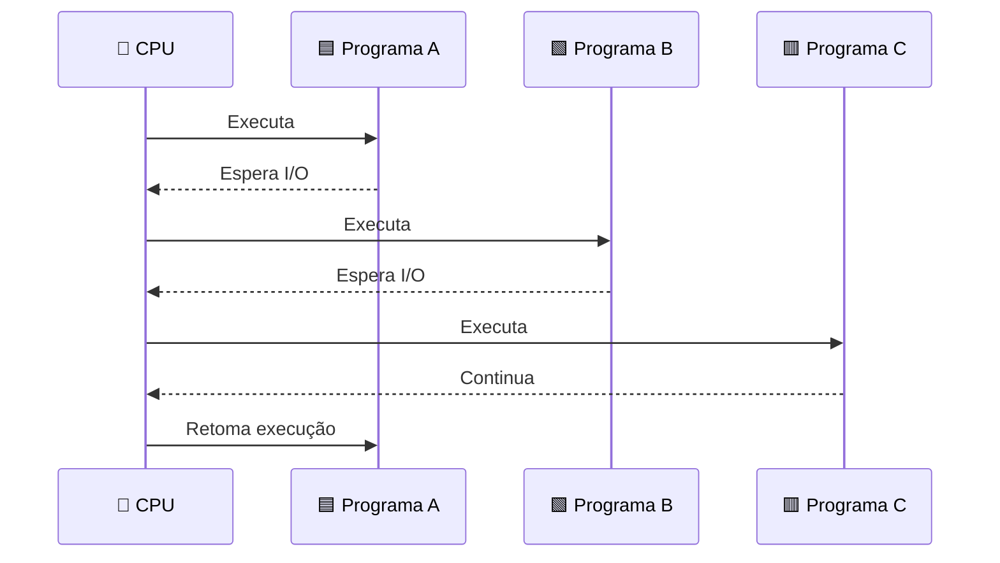
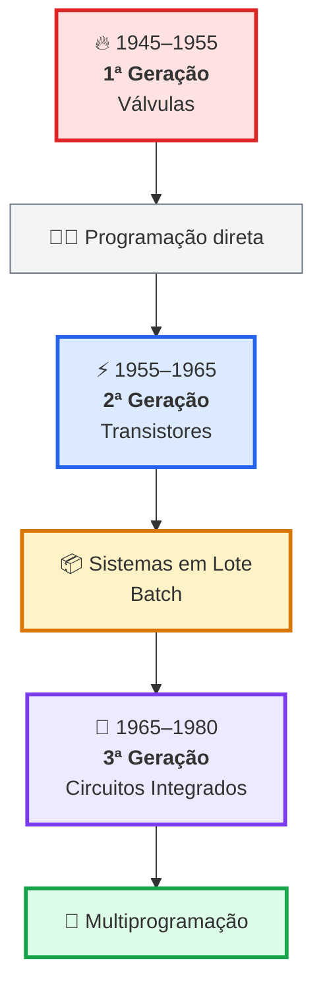
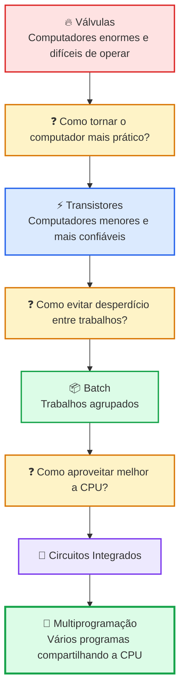
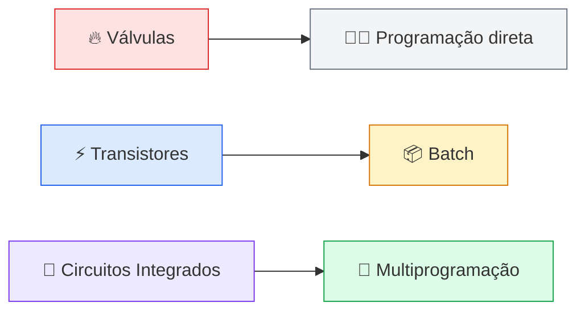
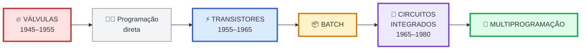

Claro. Vou voltar ao **primeiro estilo**: mais didático, com emojis, blocos de código, tabelas e explicações curtas — mas vou substituir os diagramas ASCII por **Mermaid**, que fica muito melhor renderizado no GitHub.

# 🕰️ História dos Sistemas Operacionais

> 📚 **Sistemas Operacionais Modernos — Andrew S. Tanenbaum & Herbert Bos, 4ª edição**
> 📖 Capítulo 1 — História dos Sistemas Operacionais
> 🎯 **Foco:** evolução das primeiras gerações de computadores e dos sistemas operacionais

---

## 🧭 Visão geral

A história dos **Sistemas Operacionais** acompanha diretamente a evolução do hardware.

À medida que os computadores ficaram mais rápidos e complexos, surgiram novas necessidades:

* ⚙️ controlar melhor o hardware;
* 📦 organizar os trabalhos;
* 🚀 reduzir o tempo desperdiçado;
* 🧠 utilizar melhor a CPU;
* 👨‍💻 facilitar a programação.

### 📈 Evolução geral



> ⭐ **Para estas páginas, o mais importante são as três primeiras gerações.**

---

# 🔥 1. Primeira Geração — Válvulas

### 📅 1945–1955

Os primeiros computadores eletrônicos utilizavam **válvulas eletrônicas**.

Eram máquinas enormes, caras, difíceis de programar e pouco confiáveis.

### 💻 Características

* 🔥 Produziam muito calor
* ⚡ Consumiam muita energia
* 🏢 Eram enormes
* 💰 Eram muito caros
* ❌ Apresentavam muitas falhas
* 👨‍💻 A programação era extremamente trabalhosa

### 🖥️ Visão simplificada



---

## 👨‍💻 Como era a programação?

Ainda não existiam sistemas operacionais modernos.

O programador precisava interagir diretamente com a máquina.


Isso tornava a execução dos programas muito trabalhosa.

### ⏳ O problema

O computador precisava ser preparado para cada trabalho.


> 💡 **Grande problema:** muito tempo era desperdiçado entre os trabalhos.

---

# ⚡ 2. Segunda Geração — Transistores

### 📅 1955–1965

Os **transistores** substituíram as válvulas.

Essa mudança tornou os computadores:

* 📉 menores;
* ⚡ mais eficientes;
* 🚀 mais rápidos;
* ✅ mais confiáveis;
* 💰 mais econômicos.

### 🔄 Evolução



---

# 📦 3. Sistemas em Lote — Batch

Com computadores mais rápidos, surgiu um novo problema:

> 🤔 **Como evitar que o computador fique parado enquanto alguém prepara o próximo trabalho?**

A solução foi o **processamento em lote (Batch Processing)**.

Em vez de executar um trabalho e esperar a intervenção humana para começar o próximo, vários trabalhos eram agrupados.

### 📄 Antes


### 📦 Com Batch



### 🎯 Objetivo

> **Reduzir o tempo desperdiçado entre os trabalhos e aumentar a utilização do computador.**

---

# 🔬 4. Terceira Geração — Circuitos Integrados

### 📅 1965–1980

A terceira geração foi marcada pelo uso dos **circuitos integrados (ICs)**.


### 🚀 Consequências

Os computadores ficaram:

* 📦 menores;
* 🚀 mais rápidos;
* 💰 mais baratos;
* ✅ mais confiáveis;
* 🧠 mais poderosos.

Mas a grande novidade para os sistemas operacionais foi:

# 🧠 Multiprogramação

---

# 🧠 5. Multiprogramação

A **multiprogramação** permite manter **vários programas na memória ao mesmo tempo**.



---

## 🤔 Por que isso era importante?

Imagine que o **Programa A** está esperando uma operação de entrada/saída.


Sem multiprogramação, a CPU poderia ficar ociosa.

```text
🧠 CPU
██████░░░░░░░░░████
       😴
```

### 🚀 Com multiprogramação

Enquanto A espera, outro programa pode utilizar a CPU.


Podemos pensar na sequência assim:



### 🎯 Resultado

A CPU é utilizada de forma muito mais eficiente.

```text
❌ Sem multiprogramação

██████░░░░░░░██████
      CPU ociosa


✅ Com multiprogramação

████████████████████
      CPU ocupada
```

> ⭐ **Ideia fundamental:** quando um programa está esperando I/O, outro programa pode utilizar a CPU.

---

# ⚔️ 6. Comparação das três primeiras gerações

|                     | 🔥 **1ª Geração**     | ⚡ **2ª Geração**   | 🔬 **3ª Geração**    |
| ------------------- | --------------------- | ------------------ | -------------------- |
| 📅 Período          | 1945–1955             | 1955–1965          | 1965–1980            |
| 💻 Hardware         | Válvulas              | Transistores       | Circuitos integrados |
| ⚙️ Principal avanço | Computação eletrônica | Sistemas em lote   | Multiprogramação     |
| 👨‍💻 Programação   | Muito manual          | Mais automatizada  | Mais sofisticada     |
| 🎯 Problema         | Operação trabalhosa   | Tempo desperdiçado | CPU subutilizada     |
| 💡 Solução          | —                     | 📦 Batch           | 🧠 Multiprogramação  |

---

# 🧩 7. Evolução completa



---

# 🧠 8. A lógica da evolução

A melhor forma de entender a história é pensar nos **problemas que cada geração tentou resolver**.



---

# 🎯 9. O que você PRECISA saber

## ⭐⭐⭐⭐⭐ 1. Primeira geração

> 🔥 **Válvulas → programação direta**

---

## ⭐⭐⭐⭐⭐ 2. Segunda geração

> ⚡ **Transistores → sistemas em lote (Batch)**

---

## ⭐⭐⭐⭐⭐ 3. Terceira geração

> 🔬 **Circuitos integrados → multiprogramação**

---

## ⭐⭐⭐⭐⭐ 4. Por que surgiu o Batch?

Para reduzir o tempo perdido entre a execução de diferentes trabalhos.

---

## ⭐⭐⭐⭐⭐ 5. Por que surgiu a multiprogramação?

Para aumentar a utilização da CPU.

Quando um programa está esperando I/O, outro pode utilizar o processador.

---

# 🧠 10. Macete para memorizar

### 🔥 → ⚡ → 🔬


Associe cada uma à sua principal característica:



### 💡 Frase para decorar

> ## **"Válvula programa, transistor agrupa, circuito integrado multiprograma."**

---

# 🃏 11. Flashcards

<details>
<summary>🔥 Qual tecnologia marcou a 1ª geração?</summary>

**Válvulas eletrônicas.**

📅 1945–1955

</details>

<details>
<summary>⚡ Qual tecnologia marcou a 2ª geração?</summary>

**Transistores.**

📅 1955–1965

</details>

<details>
<summary>📦 O que é Batch?</summary>

É o processamento de vários trabalhos agrupados e executados em sequência.

</details>

<details>
<summary>🔬 Qual tecnologia marcou a 3ª geração?</summary>

**Circuitos integrados (ICs).**

📅 1965–1980

</details>

<details>
<summary>🧠 O que é multiprogramação?</summary>

Manter vários programas na memória e permitir que a CPU execute outro programa enquanto o atual espera.

</details>

<details>
<summary>🚀 Qual é a principal vantagem da multiprogramação?</summary>

Aumentar a utilização da CPU.

</details>

---

# 📝 12. Quiz rápido

### ❓ 1. Qual é a sequência correta?

```text
A) ⚡ → 🔥 → 🔬
B) 🔬 → ⚡ → 🔥
C) 🔥 → ⚡ → 🔬
D) 🔥 → 🔬 → ⚡
```

<details>
<summary>✅ Resposta</summary>

**C) 🔥 → ⚡ → 🔬**

Válvulas → Transistores → Circuitos Integrados.

</details>

---

### ❓ 2. O que surgiu na segunda geração para organizar melhor os trabalhos?

<details>
<summary>✅ Resposta</summary>

📦 **Sistemas em lote (Batch Processing).**

</details>

---

### ❓ 3. Por que a multiprogramação melhora a utilização da CPU?

<details>
<summary>✅ Resposta</summary>

Porque quando um programa está esperando uma operação de I/O, outro programa pode utilizar a CPU.

</details>

---

### ❓ 4. Complete:

```text
🔥 Válvulas       → ?
⚡ Transistores   → ?
🔬 Circuitos IC   → ?
```

<details>
<summary>✅ Resposta</summary>

```text
🔥 Válvulas
→ 👨‍💻 Programação direta

⚡ Transistores
→ 📦 Batch

🔬 Circuitos Integrados
→ 🧠 Multiprogramação
```

</details>

---

# 🏁 13. Resumo final

A história dos Sistemas Operacionais acompanha a evolução do hardware.

### 🔥 1ª Geração — 1945–1955

**Válvulas**

Computadores enormes, caros, pouco confiáveis e com programação muito próxima do hardware.

⬇️

### ⚡ 2ª Geração — 1955–1965

**Transistores**

Computadores menores, mais rápidos e confiáveis.

➡️ Surge o **processamento em lote (Batch)**.

⬇️

### 🔬 3ª Geração — 1965–1980

**Circuitos Integrados**

Computadores ainda mais poderosos.

➡️ Surge a **multiprogramação**.

---

# 🚀 TL;DR



> ## 🧠 **VÁLVULAS → TRANSISTORES → CIRCUITOS INTEGRADOS**
>
> ### 👨‍💻 DIRETO → 📦 BATCH → 🧠 MULTIPROGRAMAÇÃO

---

<div align="center">

### 🚀 Hardware evoluiu → Sistemas Operacionais evoluíram

**🔥 → ⚡ → 🔬 → 🧠**

</div>

---

> 📚 **Referência:**
> TANENBAUM, Andrew S.; BOS, Herbert. *Sistemas Operacionais Modernos*. 4ª edição. Pearson.
>
> 📌 Material de revisão focado na **História dos Sistemas Operacionais**.
