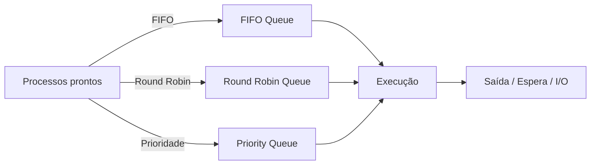

## 💻 O Que São Sistemas Operacionais?
- 📌 **Definição:** Software essencial que gerencia hardware e software  
- 🔑 **Importância:** Interface entre usuário e máquina  
- 🖥️ **Exemplos:** Windows, macOS, Linux, Android, iOS  

---

## ⚙️ Estrutura Interna: Camadas e Modelos
- 🧩 **Estrutura em Camadas:** Organização hierárquica para modularidade  
- 🏗️ **Monolítica vs. Modular:** Diferentes abordagens de design de kernel  
- 🔧 **Kernel:** Núcleo do SO, acesso direto ao hardware, gerenciamento de recursos vitais  
- 🔒 **Modos de Operação:**  
  - 👤 Modo Usuário: Programas comuns  
  - 🛡️ Modo Kernel: Privilégios elevados, acesso total  

---

## ⏱️ Escalonamento de Processos
**Objetivo:** decidir qual processo executar e por quanto tempo para otimizar eficiência, justiça e tempo de resposta.

| **Algoritmo** | **Resumo** | **Uso típico** |
|---------------|------------|----------------|
| FIFO          | Primeiro a entrar, primeiro a sair | Batch |
| Round Robin   | Fatias de tempo (quantum)          | Interativo |
| Prioridade    | Executa por prioridade; envelhecimento evita inanição | Sistemas com níveis de serviço |

### Fluxograma de Escalonamento

---

## 🧠 Gerenciamento de Memória — Real e Virtual

### Memória Principal
- Alocação dinâmica  
- Proteção entre processos  
- Compartilhamento controlado quando necessário  

### Memória Virtual
- Paginação e segmentação  
- TLB (Translation Lookaside Buffer)  
- Swap / Pagefile  

**Resumo:**  
A memória virtual permite endereçamento lógico maior que a RAM física, melhora o isolamento entre processos e possibilita execução de programas maiores. Porém, pode causar overhead quando há muito swapping.

## 🔌 Dispositivos, Sistemas de Arquivos e Futuro

### Gerenciamento de E/S
- Abstração de dispositivos via drivers  
- Tratamento de interrupções  
- Buffering  
- Filas de E/S  
- DMA (Direct Memory Access)  

### Sistemas de Arquivos
| **Sistema** | **Pontos fortes** | **Uso típico** |
|-------------|-------------------|----------------|
| ext4        | Estável, journaling | Linux |
| NTFS        | Permissões avançadas, compressão | Windows |
| FAT32/exFAT | Compatibilidade entre diferentes SOs | Dispositivos removíveis |
| XFS/ZFS     | Escalabilidade, integridade | Storage corporativo |

## 🔒 Segurança e Virtualização

### Segurança
- Autenticação  
- Autorização  
- Controle de acesso  
- Criptografia  
- Atualizações e hardening  

### Virtualização
- Hipervisores (tipo 1 e tipo 2)  
- Containers (ex.: Docker)  
- Orquestração (ex.: Kubernetes)  

### Tendências Futuras
- NFV (Network Function Virtualization)  
- Serverless na borda  
- Isolamento por hardware (SGX, TrustZone)  
- Sistemas Operacionais otimizados para IoT e edge computing  

## 💡 Dica importante — Portfólio de Projetos
**Por que:** demonstra habilidades práticas, criatividade e domínio de ferramentas; facilita avaliação e oportunidades profissionais.  

**O que incluir:**
- README claro e objetivo  
- Instruções de execução  
- Código organizado  
- Documentação técnica  
- Licença  
- Histórico de commits  
