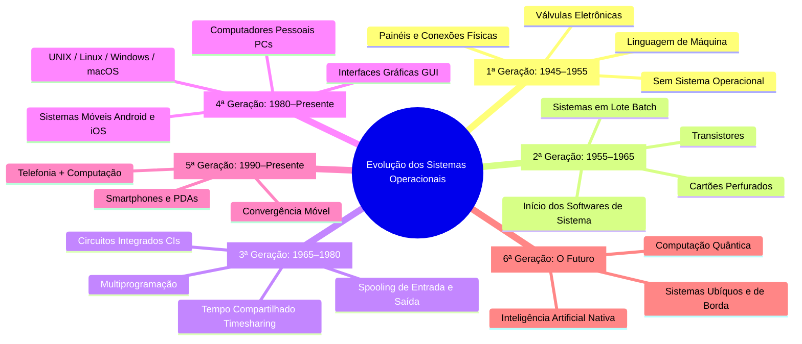

# 💻 Evolução Histórica dos Sistemas Operacionais

**Instituição:** Fatec - Faculdade de Tecnologia  
**Disciplina:** Sistemas Operacionais  
**Professor:** Prof. Me. Deivison S. Takatu ([deivison.takatu@fatec.sp.gov.br](mailto:deivison.takatu@fatec.sp.gov.br))  

---

## 📌 1. Introdução e Contexto

Os **Sistemas Operacionais (SO)** atuam como **intermediários** fundamentais entre o usuário (ou aplicação) e o *hardware* do computador. Sua principal função é abstrair a complexidade física dos componentes internos, fornecendo um ambiente eficiente, amigável e seguro para a execução de programas.

```
+-------------------------------------------------------+
|                       Usuário                         |
+-------------------------------------------------------+
|                 Aplicações / Softwares                |
+-------------------------------------------------------+
|             Sistema Operacional (SO)                  |
+-------------------------------------------------------+
|          Hardware (CPU, Memória, E/S, Disco)          |
+-------------------------------------------------------+
```

Ao longo das décadas, os SOs evoluíram em paralelo com as transformações no *hardware* e o surgimento de novas demandas de uso (desde cálculos científicos isolados até a computação móvel e ubíqua).

---

## 🧠 2. Mapa Mental da Evolução dos SOs



---

## 🕰️ 3. Detalhamento por Gerações

### 🔌 1ª Geração (1945–1955): Válvulas e Painéis
* **Tecnologia Principal:** Válvulas eletrônicas.
* **Características:**
  * Máquinas gigantescas, extremamente caras e com alto consumo de energia.
  * Baixa confiabilidade e alta taxa de falhas por superaquecimento.
  * **Ausência de Sistema Operacional:** O próprio usuário/programador operava o computador diretamente no *hardware*.
* **Programação e Operação:**
  * Feita em código de máquina absoluto.
  * Configuração manual por meio de chaveamentos, cabos e painéis de conexão física.

---

### 🎛️ 2ª Geração (1955–1965): Transistores e Processamento em Lote
* **Tecnologia Principal:** Transistores (substituição das válvulas).
* **Características:**
  * Computadores menores, mais rápidos, mais baratos e mais confiáveis.
  * Viabilização comercial das máquinas para grandes empresas e governos.
* **Sistemas em Lote (*Batch Systems*):**
  * Agrupamento de tarefas semelhantes em "lotes" para execução sequencial sem intervenção humana contínua.
  * Redução do tempo de preparação (*setup time*).
* **Entrada e Saída:**
  * Leitura e armazenamento de dados via **cartões perfurados** e fitas magnéticas.

---

### 🔲 3ª Geração (1965–1980): Circuitos Integrados e Multiprogramação
* **Tecnologia Principal:** Circuitos Integrados (CIs / Chips).
* **Características:**
  * Redução drástica do tamanho e aumento expressivo da capacidade de processamento.
  * Surgimento de famílias de computadores compatíveis (ex: IBM System/360).
* **Principais Avanços em SO:**
  * **Multiprogramação:** Mantém múltiplos programas na memória principal simultaneamente. Enquanto uma tarefa aguarda operações de $E/S$ (Entrada/Saída), a CPU é alocada para outra tarefa.
  * **Tempo Compartilhado (*Timesharing*):** Permite que múltiplos usuários interajam concorrentemente com o computador via terminais, dando a ilusão de uso exclusivo.
  * **Spooling (*Simultaneous Peripheral Operations On-Line*):** Armazenamento temporário de dados de $E/S$ em disco, otimizando o fluxo de leitura e impressão.

---

### 🖥️ 4ª Geração (1980–Presente): Computadores Pessoais e GUIs
* **Tecnologia Principal:** VLSI (*Very Large Scale Integration*) e Microprocessadores.
* **Características:**
  * Popularização dos PCs (Personal Computers), tornando o computador acessível ao indivíduo.
  * Priorização da usabilidade, estabilidade e experiência do usuário.
* **Interfaces Gráficas (GUI):**
  * Substituição das linhas de comando textuais (CLI) por janelas, ícones, menus e ponteiros de mouse.
* **Sistemas Dominantes:**
  * **UNIX:** Surgiu como simplificação do MULTICS e tornou-se a base arquitetural para **Linux**, **macOS**, **iOS** e **Android**.
  * **Sistemas Proprietários e Abertos:** MS-DOS, Windows, Linux, macOS.

---

### 📱 5ª Geração (1990–Presente): Convergência e Dispositivos Móveis
* **Tecnologia Principal:** Processadores móveis de baixo consumo (ARM), conectividade sem fio e telas sensíveis ao toque.
* **Características:**
  * Fusão entre telefonia e computação pessoal.
  * **Histórico Exemplo:** Em 1996, a Nokia lançou o **N9000** (combinação de telefone e PDA). Em 1997, a Ericsson cunhou o termo *smartphone*.
* **Sistemas Operacionais Móveis:**
  * Consolidação do **Android** e **iOS** como plataformas hegemônicas no mercado de computação móvel.

---

### 🔮 6ª Geração: O Futuro dos Sistemas Operacionais
* **Questão para Reflexão:** *Entender o passado ajuda a identificar padrões e prever o futuro. Quais serão os pilares das próximas gerações?*
* **Tendências e Possibilidades:**
  * Integrar Inteligência Artificial diretamente ao núcleo do SO (*Kernel Level AI*).
  * Computação Ubíqua e de Borda (*Edge Computing*).
  * Gestão de recursos para Computação Quântica.
  * Maior segurança nativa, privacidade por design e computação confidencial.

---

## 📊 4. Tabela Comparativa Resumida das Gerações

| Geração | Período | Tecnologia Base | Entrada/Saída | Conceitos / Avanços Chave | Exemplo de Uso / Sistemas |
| :--- | :--- | :--- | :--- | :--- | :--- |
| **1ª Geração** | 1945–1955 | Válvulas | Painéis, Chaves Físicas | Código de Máquina, Sem SO | ENIAC, Univac I |
| **2ª Geração** | 1955–1965 | Transistores | Cartões Perfurados | Processamento em Lote (*Batch*) | IBM 7094 |
| **3ª Geração** | 1965–1980 | Circuitos Integrados (CIs) | Terminais e Fitas/Discos | Multiprogramação, *Timesharing*, *Spooling* | IBM OS/360, MULTICS |
| **4ª Geração** | 1980–Pres. | Microprocessadores | Teclado, Mouse, Telas | Interfaces Gráficas (GUI), SOs Pessoais | MS-DOS, Windows, Linux, macOS |
| **5ª Geração** | 1990–Pres. | Chips Móveis / SoC | *Touchscreen*, Sensores | Convergência Móvel, Sistemas Embarcados | Android, iOS, Symbian |
| **6ª Geração** | Futuro | Quântica, IA Nativa | Voz, Gestos, BCI | Decisões por IA, Computação Ubíqua | SOs Autônomos e Distribuídos |

---

## 🔍 5. Estudo de Caso & Atividades

### 🤖 Estudo de Caso: OpenClaw
* **Visão Geral:** Ferramenta focada em automação pessoal e produtividade via aplicativos de mensagem (WhatsApp, Telegram).
* **Funcionalidades:** Limpeza de caixa de entrada, envio de e-mails, gerenciamento de agenda, check-in de voos.
* **Segurança:** Parceria com o *VirusTotal* para validação de segurança e habilidades (*Skill Security*).

### 📝 Atividades da Disciplina
1. **Resumo em Markdown (`.md`):**
   * Criar no repositório da disciplina um arquivo Markdown com mais de 500 linhas.
   * O texto deve ser um resumo detalhado e organizado do capítulo *História dos Sistemas Operacionais* (TANENBAUM; BOS, 2015).
2. **Linha do Tempo Expandida (Miro + GitHub):**
   * Ampliar a linha do tempo apresentada em aula com novos exemplos detalhados para cada geração.
   * Exportar a linha do tempo do Miro e salvar no repositório GitHub como material de estudo.
3. **Atividade Interativa:**
   * Participação no quiz *Kahoot!* em sala de aula.

---

## 📚 6. Referências Bibliográficas

* TANENBAUM, Andrew S.; BOS, Herbert. **Sistemas Operacionais Modernos**. 4. ed. São Paulo: Pearson, 2016.
* SILBERSCHATZ, Abraham; GALVIN, Peter B.; GAGNE, Greg. **Fundamentos de Sistemas Operacionais**. 9. ed. Rio de Janeiro: LTC, 2015.
* STALLINGS, William. **Sistemas Operacionais: Conceitos e Projetos**. 8. ed. São Paulo: Pearson, 2015.
* DENARDIN, G. W.; BARRIQUELLO, C. H. **Sistemas Operacionais de Tempo Real e sua Aplicação em Sistemas Embarcados**. Porto Alegre: Editora da UFRGS, 2014.
* AWASTHI, A.; RAWAT, V. **Ramificação e Tarefas do Sistema Operacional**. Edições Nosso Conhecimento, 2023.
* DOWNEY, Allen B. **Think OS: A Brief Introduction to Operating Systems**. Green Tea Press, 2015.
* RED HAT. **Red Hat Enterprise Linux - System Administration Guide**. Documentação Oficial.
* DOCKER INC. **Docker Documentation**. Disponível em: <https://docs.docker.com>.
