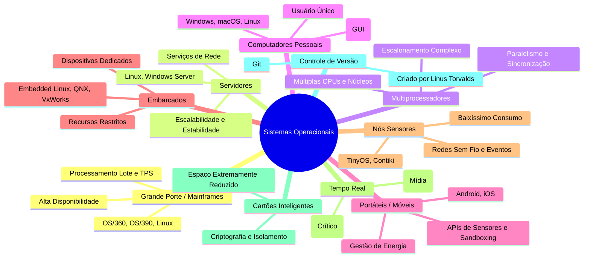

# 🖥️ Conceitos, Funções e Tipos de Sistemas Operacionais

**Instituição:** Fatec - Faculdade de Tecnologia  
**Disciplina:** Sistemas Operacionais  
**Professor:** Prof. Me. Deivison S. Takatu ([deivison.takatu@fatec.sp.gov.br](mailto:deivison.takatu@fatec.sp.gov.br))

---

## 📌 Sumário
1. [Introdução aos Sistemas Operacionais](#-1-introdução-aos-sistemas-operacionais)
2. [Mapa Mental dos Tipos de Sistemas Operacionais](#-2-mapa-mental-dos-tipos-de-sistemas-operacionais)
3. [Tipos de Sistemas Operacionais em Detalhes](#-3-tipos-de-sistemas-operacionais-em-detalhes)
   - [3.1 Sistemas de Grande Porte (Mainframes)](#31-sistemas-de-grande-porte-mainframes)
   - [3.2 Sistemas Operacionais de Servidor](#32-sistemas-operacionais-de-servidor)
   - [3.3 Sistemas de Multiprocessadores](#33-sistemas-de-multiprocessadores)
   - [3.4 Sistemas de Computadores Pessoais](#34-sistemas-de-computadores-pessoais)
   - [3.5 Sistemas Operacionais Portáteis](#35-sistemas-operacionais-portáteis)
   - [3.6 Sistemas Embarcados](#36-sistemas-embarcados)
   - [3.7 Sistemas de Nós Sensores](#37-sistemas-de-nós-sensores)
   - [3.8 Sistemas de Tempo Real](#38-sistemas-de-tempo-real)
   - [3.9 Sistemas de Cartões Inteligentes](#39-sistemas-de-cartões-inteligentes-smart-cards)
4. [Tabela Comparativa Resumida](#-4-tabela-comparativa-resumida)
5. [Introdução ao Controle de Versão com Git](#-5-introdução-ao-controle-de-versão-com-git)
6. [Referências Bibliográficas](#-6-referências-bibliográficas)

---

## 💡 1. Introdução aos Sistemas Operacionais

Os Sistemas Operacionais (SOs) são projetados e otimizados de acordo com as necessidades específicas do *hardware* e o contexto de aplicação. Vários fatores arquiteturais — como capacidade de processamento, consumo energético, tempo de resposta e quantidade de usuários simultâneos — determinam o tipo de sistema operacional utilizado.

---

## 🧠 2. Mapa Mental dos Tipos de Sistemas Operacionais

---

## 📑 3. Tipos de Sistemas Operacionais em Detalhes

### 🏬 3.1 Sistemas de Grande Porte (Mainframes)
Projetados para lidar com alta capacidade de Entrada/Saída ($E/S$) e processamento massivo de transações simultâneas.

* **Características Principais:**
  * Alta confiabilidade, disponibilidade e tolerância a falhas.
  * Foco em processamento em lote (*batch*) e Processamento de Transações (TPS).
  * Rigoroso controle de segurança e integridade de dados.
* **Uso Típico:** Instituições bancárias, grandes redes de varejo, servidores de e-commerce de alta escala e órgãos governamentais.
* **Exemplos:**
  * $OS/360$, $OS/390$
  * Linux (adaptado para arquiteturas de mainframe)
  * Variantes da família UNIX

---

### 🖥️ 3.2 Sistemas Operacionais de Servidor
Focados no atendimento a múltiplos usuários e no provimento de serviços distribuídos em redes de computadores.

* **Características Principais:**
  * Oferecem serviços como hospedagem web, bancos de dados, compartilhamento de arquivos e autenticação.
  * Foco em alta estabilidade, escalabilidade e gestão eficiente de recursos.
* **Exemplos de Destaque:**
  * **Linux:** Liderança de mercado, alta flexibilidade, segurança e vasto ecossistema.
  * **Windows Server:** Forte integração com *Active Directory* e serviços corporativos Microsoft.

---

### ⚡ 3.3 Sistemas de Multiprocessadores
Desenvolvidos para tirar proveito do paralelismo computacional oferecido por arquiteturas com múltiplas CPUs ou múltiplos núcleos (*multicore*).

* **Desafios e Soluções Arquiteturais:**
  * **Escalonamento:** Distribuição equilibrada de carga (*load balancing*) entre os núcleos disponíveis.
  * **Sincronização:** Uso de *locks*, semáforos e estruturas *lock-free* para evitar condições de corrida (*race conditions*).
  * **Coerência de Cache:** Manutenção de dados consistentes entre caches locais e memória principal.
* **Aplicações:** Processamento científico, simulações complexas e servidores de altíssimo desempenho.

---

### 💻 3.4 Sistemas de Computadores Pessoais
Direcionados para o uso individual (*single-user*), priorizando usabilidade, riqueza multimídia e alta compatibilidade de softwares.

* **Características Principais:**
  * Suporte robusto a multiprogramação e execução concorrente de tarefas.
  * Interface Gráfica do Usuário (GUI) como meio primário de interação.
* **Principais Exemplos:**
  * **Windows:** Domínio em software corporativo, de produtividade e jogos.
  * **macOS:** Forte integração hardware-software com foco em experiência do usuário e design.
  * **Linux:** Altamente personalizável, preferido por desenvolvedores e *power users*.

---

### 📱 3.5 Sistemas Operacionais Portáteis
Projetados para dispositivos móveis com restrições físicas de bateria e tamanho.

* **Aspectos Chave:**
  * **Gerenciamento de Energia:** Algoritmos agressivos de economia de carga e *sleep modes*.
  * **APIs de Sensores:** Suporte nativo a GPS, acelerômetro, giroscópio, biometria e câmeras.
  * **Segurança:** Isolamento por permissões de usuário e execução em contêineres (*sandboxing*).
  * **Distribuição:** Ecossistema centralizado via lojas oficiais de aplicativos.
* **Exemplos:** Android, iOS.

---

### 📟 3.6 Sistemas Embarcados
Sistemas operacionais que rodam em dispositivos com funções dedicadas e recursos computacionais bastante limitados.

* **Características:**
  * O código do sistema tipicamente reside em memórias não voláteis (ROM ou Flash).
  * O usuário final geralmente não instala nem altera o software interno.
* **Categorias e Aplicações:**
  1. **Aplicações Domésticas:** Micro-ondas, Smart TVs (interface simples e resposta imediata).
  2. **Setor Automotivo:** Módulos de controle do motor (ECU) e centrais de entretenimento (*infotainment*).
  3. **Sistemas Embarcados Sofisticados:** Utilizam *Embedded Linux*, QNX ou VxWorks quando é requerida maior flexibilidade.

---

### 🌐 3.7 Sistemas de Nós Sensores
Projetados para pequenos nós coletores de dados interligados via rede sem fio, frequentemente alimentados por baterias não recarregáveis.

* **Características Principais:**
  * Dispositivos com dimensões reduzidas e recursos de memória/CPU mínimos.
  * Arquitetura de software orientada a eventos (*event-driven*).
  * Emprego de protocolos de comunicação leves e de ultra-baixo consumo.
* **Aplicações:** Agricultura de precisão, monitoramento ambiental e vigilância militar.
* **Exemplos de SO:** TinyOS, Contiki.

---

### ⏱️ 3.8 Sistemas de Tempo Real
Sistemas onde o tempo de resposta e o cumprimento rigoroso de prazos (*deadlines*) são tão críticos quanto a exatidão do cálculo efetuado.

* **Divisão Clássica:**
  1. **Hard Real-Time (Rígido):** A perda de um prazo constitui falha total do sistema e pode causar acidentes graves ou catastróficos.
     * *Exemplos:* Sistemas de controle de voo, freios ABS, marca-passos.
  2. **Soft Real-Time (Flexível):** A perda eventual de um prazo degrada a qualidade do serviço, mas não resulta em danos desastrosos.
     * *Exemplos:* Streaming de vídeo/áudio, jogos online e aplicações multimídia.

---

### 💳 3.9 Sistemas de Cartões Inteligentes (*Smart Cards*)
Sistemas operacionais minúsculos que rodam em *chips* integrados a cartões plásticos.

* **Desafios e Soluções:**
  * **Recursos Extremamente Restritos:** Gerenciamento cirúrgico de memória RAM e EEPROM/Flash.
  * **Segurança Avançada:** Suporte a motores de criptografia, autenticação segura e proteção contra ataques de canal lateral (*side-channel attacks*).
  * **Isolamento de Aplicações:** Execução de pequenas aplicações (*applets*) com rígido controle de isolamento.

---

## 📊 4. Tabela Comparativa Resumida

| Tipo de Sistema | Foco Principal | Restrição Dominante | Exemplo de Aplicação | Exemplos de SO |
| :--- | :--- | :--- | :--- | :--- |
| **Mainframe** | Processamento Massivo / TPS | Vazão de $E/S$ e Custo | Bancos e Varejo | $OS/390$, Linux |
| **Servidor** | Serviços de Rede / Multi-usuário | Disponibilidade e Escalabilidade | Web e Bancos de Dados | Linux Server, Windows Server |
| **Multiprocessador** | Paralelismo Computacional | Sincronização e Caches | Computação Científica | Linux, Variantes UNIX |
| **Pessoal (PC)** | Usabilidade e Interatividade | Satisfação do Usuário | Escritório, Jogos | Windows, macOS, Linux |
| **Portátil / Móvel** | Mobilidade e Conectividade | Consumo de Bateria | Smartphones | Android, iOS |
| **Embarcado** | Tarefa Específica / Dedicada | Custo de Hardware e RAM | Automotivo, Appliances | Embedded Linux, QNX |
| **Nó Sensor** | Coleta de Dados sem Fio | Bateria e Alcance | Monitoramento Ambiental | TinyOS, Contiki |
| **Tempo Real** | Cumprimento de Prazos (*Deadlines*) | Latência de Resposta | Controle Aéreo e ABS | VxWorks, FreeRTOS |
| **Smart Card** | Autenticação e Criptografia | Tamanho Físico e Memória | Cartões Bancários / SIM | Java Card, Multos |

---

## 🛠️ 5. Introdução ao Controle de Versão com Git

* **O que é o Git?**
  * É um **Sistema de Controle de Versões Distribuído (DVCS)** criado por **Linus Torvalds** em 2005.
  * Executado diretamente na máquina do desenvolvedor via Interface de Linha de Comando (CLI) ou clientes gráficos.
* **Principais Funcionalidades:**
  * **Sincronização:** Envia e baixa alterações de código entre repositórios locais e remotos (ex.: GitHub, GitLab).
  * **Histórico Completo:** Registra o histórico de alterações do projeto através de *commits*.
  * **Rastreabilidade e Reversão:** Permite navegar entre diferentes versões do código e restaurar estados anteriores caso necessário.

---

## 📚 6. Referências Bibliográficas

* LOELIGER, Jon; MCCULLOUGH, Matthew. **Version Control with Git**. 2. ed. O'Reilly Media, 2012 / 2021.
* TANENBAUM, Andrew S.; BOS, Herbert. **Sistemas Operacionais Modernos**. 4. ed. São Paulo: Pearson, 2016.
* SILBERSCHATZ, Abraham; GALVIN, Peter B.; GAGNE, Greg. **Fundamentos de Sistemas Operacionais**. 9. ed. Rio de Janeiro: LTC, 2015.
