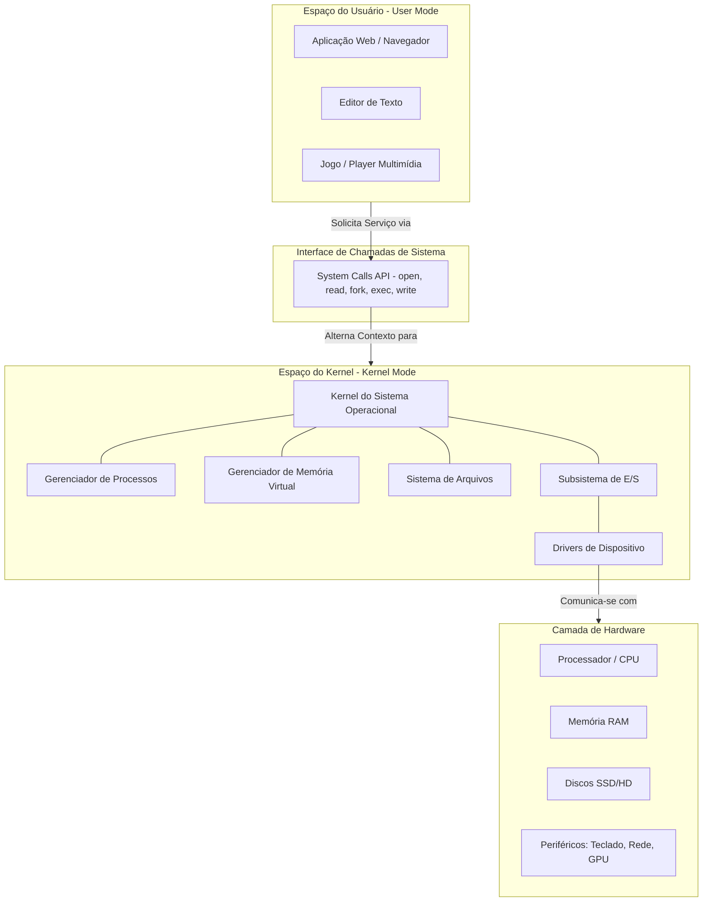
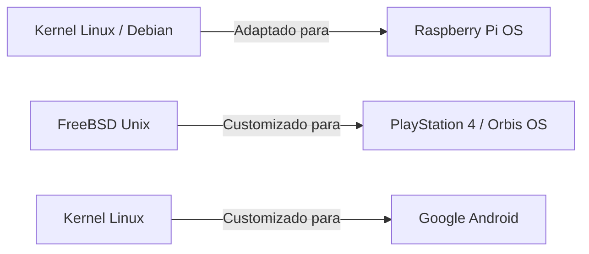

# 🏛️ Estrutura e Arquitetura de Sistemas Operacionais

**Instituição:** Fatec - Faculdade de Tecnologia  
**Disciplina:** Sistemas Operacionais  
**Professor:** Prof. Me. Deivison S. Takatu ([deivison.takatu@fatec.sp.gov.br](mailto:deivison.takatu@fatec.sp.gov.br))  

---

## 📌 Sumário
1. [Por que Precisamos de um Sistema Operacional?](#-1-por-que-precisamos-de-um-sistema-operacional)
2. [Componentes Principais do SO](#-2-componentes-principais-do-so)
3. [Visão Geral Arquitetural (Mermaid)](#-3-visão-geral-arquitetural)
4. [O Kernel e Modos de Execução](#-4-o-kernel-e-modos-de-execução)
5. [A Tríade: Programa vs. Processo vs. Thread](#-5-a-tríade-programa-vs-processo-vs-thread)
6. [Sistema de Arquivos e Dispositivos de E/S](#-6-sistema-de-arquivos-e-dispositivos-de-es)
7. [Reaproveitamento de Estruturas em SOs](#-7-reaproveitamento-de-estruturas-em-sos)
8. [Tabela Comparativa da Arquitetura](#-8-tabela-comparativa-da-arquitetura)
9. [Atividades Práticas](#-9-atividades-práticas)
10. [Referências Bibliográficas](#-10-referências-bibliográficas)

---

## ❓ 1. Por que Precisamos de um Sistema Operacional?

Sem um Sistema Operacional (SO), cada aplicação legada ou moderna precisaria implementar individualmente toda a lógica para interagir diretamente com os componentes do computador.

### ⚠️ O Cenário Sem Sistema Operacional:
* **Controle Direto de Memória:** Cada programa precisaria gerenciar seus endereços físicos de RAM manualmente.
* **Acesso Direto à CPU:** Necessidade de gerenciar interrupções e alternância de tarefas diretamente.
* **Controle de Periféricos:** Programar individualmente cada protocolo de comunicação de hardware.
* **Gestão Manual de Arquivos:** Gravar blocos brutos nos discos sem um sistema estruturado.
* **Insegurança:** Ausência de barreiras de proteção entre programas e o hardware.

> 💡 **Conclusão:** O SO atua como uma **camada de abstração** essencial, simplificando a programação e garantindo segurança, estabilidade e isolamento entre as aplicações e o *hardware*.

---

## 🧱 2. Componentes Principais do SO

Um Sistema Operacional moderno é composto por submódulos especializados, cada um responsável por um recurso crítico da máquina:

```
+------------------------------------------------------------------+
|                    APLICAÇÕES / USUÁRIO                          |
+------------------------------------------------------------------+
|                          INTERFACE (GUI / CLI)                   |
+------------------------------------------------------------------+
|                                                                  |
|   +----------------------------------------------------------+   |
|   |                  GERENCIADOR DE PROCESSOS                |   |
|   +----------------------------------------------------------+   |
|   |                  GERENCIADOR DE MEMÓRIA                  |   |
|   +----------------------------------------------------------+   |
|   |                  SISTEMA DE ARQUIVOS                     |   |
|   +----------------------------------------------------------+   |
|   |               GERENCIADOR DE E/S & DRIVERS               |   |
|   +----------------------------------------------------------+   |
|                                                                  |
|                          KERNEL (NÚCLEO)                         |
+------------------------------------------------------------------+
|                         HARDWARE FÍSICO                          |
+------------------------------------------------------------------+
```

1. ⚙️ **Kernel (Núcleo):** O coração do SO; gerencia os recursos críticos e o acesso ao hardware.
2. 🔄 **Gerenciamento de Processos:** Controla a criação, escalonamento, sincronização e finalização de tarefas.
3. 🧠 **Gerenciamento de Memória:** Trata da alocação, paginação, memória virtual e proteção de áreas de memória.
4. 📂 **Sistema de Arquivos:** Organiza e estrutura a leitura, escrita e persistência de dados no armazenamento.
5. ⌨️ **Gerenciamento de Entrada/Saída ($E/S$):** Coordena a comunicação entre a CPU e dispositivos externos.
6. 🔌 **Drivers de Dispositivo:** Módulos de software específicos que traduzem ordens genéricas do SO para comandos suportados pelo hardware.

---

## 🎨 3. Visão Geral Arquitetural

O diagrama abaixo ilustra o fluxo de chamadas e o isolamento entre o espaço do usuário (*User Space*) e o espaço do kernel (*Kernel Space*):



---

## 🛡️ 4. O Kernel e Modos de Execução

O **Kernel** é o componente de maior privilégio no computador. Para garantir a integridade do sistema, os processadores modernos fornecem diferentes **modos de execução**:

### 🛡️ Modos de Operação do Processador

| Modo | Nível de Privilégio | Descrição | O que executa aqui? |
| :--- | :---: | :--- | :--- |
| **Modo Usuário** (*User Mode*) | Restrito | Acesso limitado à memória e instruções do processador. Não pode acessar hardware diretamente. | Navegadores, Editores, Jogos, Utilitários do usuário. |
| **Modo Kernel** (*Kernel Mode*) | Total / Irrestrito | Acesso completo a todas as instruções do processador, endereços de memória e hardware. | Núcleo do SO, Drivers de baixo nível, Gerenciadores de memória/processos. |

### 🌉 System Calls (Chamadas de Sistema)
Quando uma aplicação em *Modo Usuário* precisa realizar uma ação restrita (ex: ler um arquivo do disco ou enviar dados pela rede), ela **não pode** fazê-lo diretamente. Em vez disso:

1. A aplicação faz uma **System Call** (Chamada de Sistema).
2. O processador altera o modo de operação de *Modo Usuário* para *Modo Kernel*.
3. O Kernel valida a permissão, executa a operação com segurança e retorna o resultado.
4. O processador retorna ao *Modo Usuário*.

---

## ⚙️ 5. A Tríade: Programa vs. Processo vs. Thread

É fundamental compreender as diferenças entre esses três conceitos essenciais da computação:

```
+------------------------------------------------------------------------+
|                               PROGRAMA                                 |
|                  (Arquivo Estático no Disco / Executável)              |
+------------------------------------------------------------------------+
                                   |
                                   v  (Carregado na Memória)
+------------------------------------------------------------------------+
|                               PROCESSO                                 |
|                   (Programa em Execução na Memória)                    |
|  +------------------------------------------------------------------+  |
|  | Espaço de Endereçamento (Código, Dados, Heap, Tabela de Arquivos)   |  |
|  +------------------------------------------------------------------+  |
|                                                                        |
|  [ Thread 1 (Stack, Regs) ]  [ Thread 2 (Stack, Regs) ] ...            |
+------------------------------------------------------------------------+
```

### 🔍 Comparativo do Conceito:

* 📄 **Programa:** É um arquivo passivo armazenado no disco rígido ou SSD contendo um conjunto de instruções (ex: `chrome.exe`).
* ⚡ **Processo:** É um programa ativo carregado na memória RAM em execução. Possui seu próprio espaço reservado de memória, tabela de arquivos abertos e registradores.
* 🧵 **Thread:** É a menor unidade de execução dentro de um processo. Múltiplas threads dentro do mesmo processo compartilham o mesmo espaço de memória, mas possuem suas próprias pilhas de execução (*stacks*).

#### 💡 Exemplo Prático: Google Chrome
* **Aplicação:** Google Chrome.
* **Processo:** `chrome.exe` (pode haver múltiplos processos para isolar abas ou extensões).
* **Threads:** Múltiplas threads internas manipulando o renderizador de tela, downloads e scripts em segundo plano.

---

## 📂 6. Sistema de Arquivos e Dispositivos de E/S

### 🌲 Sistema de Arquivos
Organiza os dados fisicamente gravados no disco em uma estrutura lógica e hierárquica (árvore de diretórios):

```
/ (Diretório Raiz)
├── Aulas/
│   ├── SO/
│   │   ├── Aula01.pdf
│   │   └── Aula04.pdf
│   └── Matemática/
│       └── ListaMat.txt
├── Fotos/
└── Disciplinas/
```

### 🖱️ Entrada/Saída ($E/S$) e Drivers
Os **Drivers de Dispositivos** funcionam como "tradutores" padronizados entre os periféricos e o SO:

* ⌨️ **Teclado:** Converte pressionamentos de teclas físicas em caracteres/scancodes.
* 🖱️ **Mouse:** Converte deslocamentos e cliques em coordenadas de tela.
* 🌐 **Placa de Rede:** Empacota e envia/recebe quadros e pacotes de rede.
* 🖨️ **Impressora:** Traduz documentos formatados em comandos de impressão legíveis pelo equipamento.
* 💽 **Disco / SSD:** Transforma pedidos de leitura/escrita lógica em acesso aos blocos de armazenamento.

---

## 🔄 7. Reaproveitamento de Estruturas em SOs

Criar um Sistema Operacional do zero é uma tarefa extremamente dispendiosa e complexa. Por isso, a maioria dos sistemas modernos utiliza **bases de código e kernels consolidados** (como o Linux ou FreeBSD).

### ✅ Vantagens do Reaproveitamento:
* **Redução Significativa de Custos:** Economia de milhares de horas de desenvolvimento.
* **Estabilidade e Confiabilidade:** Aproveitamento de sistemas testados por milhões de usuários.
* **Segurança Aprimorada:** Correções contínuas fornecidas pela comunidade global.
* **Ecossistema Existente:** Compatibilidade imediata com milhares de drivers e softwares.

### 🎮 Exemplos Notáveis da Indústria:



1. 🍓 **Raspberry Pi OS:** Utiliza a distribuição **Debian (Linux)** otimizada para arquiteturas ARM.
2. 🎮 **PlayStation 4 (Orbis OS):** Construído sobre uma versão modificada do **FreeBSD** (sistema Unix de código aberto).

---

## 📊 8. Tabela Comparativa da Arquitetura

| Conceito / Componente | Função Principal | Localização / Modo | Exemplo Prático |
| :--- | :--- | :--- | :--- |
| **Kernel** | Gerenciamento de recursos de baixo nível | Modo Kernel | Linux Kernel, Windows NT Kernel |
| **System Call** | Ponte de comunicação entre App e Kernel | Transição de Modo | `sys_read()`, `sys_write()`, `fork()` |
| **Processo** | Instância isolada de programa em execução | Espaço do Usuário | Processo do MySQL, Processo do VSCode |
| **Thread** | Sub-fluxo de execução concorrente | Dentro do Processo | Thread de renderização da interface |
| **Driver** | Tradutor de ordens para o hardware | Modo Kernel (maioria) | Driver de Placa de Vídeo (NVIDIA) |
| **Sistema de Arquivos** | Organização estruturada de dados | Gerenciado pelo Kernel | ext4, NTFS, APFS, FAT32 |

---

## 📝 9. Atividades Práticas

### 🧪 Atividade 01: Processo de Formatação e Instalação de SO
1. Acesse o roteiro da atividade no repositório oficial da disciplina.
2. Elabore um documento em **Markdown (`.md`)** detalhando passo a passo o processo técnico de formatação e instalação de um SO.
3. **Exigência:** Explique quais componentes da arquitetura do SO (Kernel, Particionamento do Sistema de Arquivos, Carga de Drivers) atuam em cada etapa.

### 🔍 Atividade 02: Estudo sobre SOs Derivados
1. Pesquise e identifique **5 Sistemas Operacionais** desenvolvidos a partir de uma base/kernel existente (ex: Android baseado em Linux, macOS baseado em Darwin/BSD, etc.).
2. Monte uma **Tabela Comparativa** destacando:
   * Nome do SO derivado.
   * Sistema/Kernel base original.
   * Principais modificações e finalidade do novo sistema.
3. Salve o resultado em formato Markdown (`.md`) no repositório da disciplina.

---

## 📚 10. Referências Bibliográficas

* TANENBAUM, Andrew S.; BOS, Herbert. **Sistemas Operacionais Modernos**. 4. ed. São Paulo: Pearson, 2016.
* SILBERSCHATZ, Abraham; GALVIN, Peter B.; GAGNE, Greg. **Fundamentos de Sistemas Operacionais**. 9. ed. Rio de Janeiro: LTC, 2015.
* STALLINGS, William. **Sistemas Operacionais: Conceitos e Projetos**. 8. ed. São Paulo: Pearson, 2015.
* DENARDIN, G. W.; BARRIQUELLO, C. H. **Sistemas Operacionais de Tempo Real e sua Aplicação em Sistemas Embarcados**. Porto Alegre: Editora da UFRGS, 2014.
* DOWNEY, Allen B. **Think OS: A Brief Introduction to Operating Systems**. Green Tea Press, 2015.
* RED HAT. **Red Hat Enterprise Linux - System Administration Guide**. Documentação Oficial.
