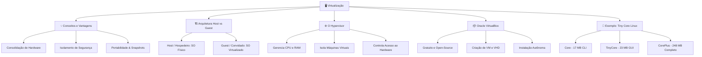

# 🖥️ Aula 05: Introdução à Virtualização
**Disciplina:** Sistemas Operacionais  
**Professor:** Me. Deivison S. Takatu  
**Instituição:** Fatec - Faculdade de Tecnologia  

---

## 🧠 Mapa Mental da Aula



---

## 1. O que é Virtualização? 🌐

A **Virtualização** é uma tecnologia que permite executar múltiplos Sistemas Operacionais (SOs) simultaneamente em um único computador físico.

### 🎯 Princípio Fundamental
Criação de ambientes virtuais **totalmente isolados** que simulam um hardware real. Isso possibilita testes, desenvolvimento e produção sem risco de afetar a máquina principal.

---

## 2. Vantagens da Virtualização 🚀

| Vantagem | Descrição |
| :--- | :--- |
| 💰 **Economia de Hardware** | Consolida múltiplos servidores em um único equipamento físico, reduzindo custos de energia e espaço. |
| 🛡️ **Isolamento Seguro** | Executa testes de softwares não confiáveis ou suscetíveis a falhas sem comprometer o SO hospedeiro. |
| 📸 **Recuperação Rápida** | Uso de *snapshots* (capturas de estado) para restauração imediata do ambiente em caso de erro. |
| 🔄 **Múltiplos SOs** | Permite rodar Linux, Windows e outros sistemas em paralelo na mesma máquina. |
| 📦 **Portabilidade Absoluta** | A máquina virtual inteira pode ser empacotada e movida para outro computador facilmente. |

---

## 3. Arquitetura e Componentes Chave 🏗️

```text
+---------------------------------------------------+
|               Sistema Convidado (Guest)           |
|            (ex: Ubuntu, Windows, Tiny Core)       |
+---------------------------------------------------+
|              Hypervisor (ex: VirtualBox)          |
+---------------------------------------------------+
|              Sistema Hospedeiro (Host)            |
|             (ex: Windows 11, macOS, Linux)        |
+---------------------------------------------------+
|                 Hardware Físico                   |
|              (CPU, RAM, Disco, Rede)              |
+---------------------------------------------------+
```

### 🧩 Elementos Principais:
1. **Sistema Hospedeiro (Host):** O sistema operacional original rodando diretamente no hardware físico.
2. **Hypervisor (VMM):** A camada de software responsável por criar, gerenciar e alocar recursos para as VMs.
3. **Sistema Convidado (Guest):** O sistema operacional instalado dentro do ambiente virtualizado.

---

## 4. O Gerenciador: Oracle VirtualBox 📦

O **Oracle VirtualBox** é uma das ferramentas de virtualização mais populares do mercado:
* 🆓 **Gratuito e Open-Source** (para uso pessoal e educacional).
* 🌐 **Multiplataforma** (compatível com Windows, Linux, macOS e Solaris).

### 🎛️ Visão Geral da Interface

```
+-----------------------------------------------------------------------+
|  [Novo]  [Configurações]  [Iniciar]                                   |
+----------------------------------+------------------------------------+
| Lista de VMs                     | Painel de Detalhes                 |
| ----------------                 | ------------------                 |
| 🟢 win10-vm (Powered Off)        | ⚙️ Sistema: 2048 MB RAM, 2 vCPUs  |
| 🔴 lubuntu-test (Running)        | 🖥️ Tela: 128 MB VRAM                |
| ⚪ tinycore-vm (Powered Off)     | 💾 Armazenamento: VHD 20 GB        |
|                                  | 🌐 Rede: NAT                       |
+----------------------------------+------------------------------------+
```

---

## 5. Passo a Passo: Criando e Instalando uma VM 🛠️

```text
[1. Baixar ISO] ➡️ [2. Criar VM no VirtualBox] ➡️ [3. Alocar Recursos] ➡️ [4. Montar ISO e Bootar]
```

1. **Obter a Imagem ISO:** Baixe o arquivo `.iso` do SO que deseja instalar.
2. **Criar Nova VM:** Clique em **Nova**, defina o Nome, Pasta do projeto e selecione o arquivo ISO.
3. **Configurar Hardware:**
   * **Memória RAM:** Mínimo recomendado de 2048 MB (2 GB) para sistemas desktop padrão.
   * **Processador:** Aloque 1 ou mais vCPUs.
   * **Disco Virtual (VHD):** Crie um disco rígido virtual (ex: 20 GB a 40 GB).
4. **Instalação Autônoma (Unattended Install):** Recurso do VirtualBox que automatiza a criação de usuário, senha e hostname antes do boot inicial.
5. **Iniciar e Instalar:** Execute a VM e conclua a instalação padrão do sistema convidado.

---

## 6. Estudo de Caso: Tiny Core Linux 🐧

O **Tiny Core Linux** é uma distribuição Linux ultraleve, ideal para entender a modularidade de um SO com consumo mínimo de recursos.

| Edição | Tamanho | Recursos Incluídos | Indicado para |
| :--- | :---: | :--- | :--- |
| **Core** | **17 MB** | Apenas linha de comando (CLI) | Servidores minimalistas e usuários avançados. |
| **TinyCore** | **23 MB** | Interface Gráfica Leve (GUI FLTK/FLWM) | Ambientes leves com conexão via cabo. |
| **CorePlus** | **248 MB** | Suporte Wi-Fi, múltiplos gerenciadores e layouts | Instalações em notebooks e redes sem fio. |

---

## 7. Apresentação de Trabalhos e Grupos 📢

* **Data da Apresentação:** $14/09/2026$
* **Duração:** 10 a 15 minutos por grupo
* **Requisito:** Participação de todos os integrantes (Trazer notebook pessoal, se possível).

### 👥 Divisão de Horários e Distribuições

#### ⏰ Bloco 1: 09h30 às 11h10
* **Grupo A (Kali Linux):** Jaquelline, Juliana, Maria E.
* **Grupo B (Lubuntu):** Ana Clara, Ana Laura, Giovana, Evelyn.
* **Grupo C (Ubuntu):** Alan, Bernardo F., João Pedro, Reinaldo.

#### ⏰ Bloco 2: 11h20 às 13h00
* **Grupo D (Zorin OS):** Bernardo C., Kauã, Kayky, Vinicius.
* **Grupo E (Linux Mint):** Enzo, Gabriel, Karl, Matheus T.
* **Grupo F (Fedora):** Adrian, Gustavo, Igor, Matheus A.

---

## 8. Atividade Prática 📝

1. **Instalação:** Instale o Oracle VirtualBox em sua máquina física.
2. **Criação de VM:** Crie uma máquina virtual e instale uma distribuição Linux leve (*Tiny Core*, *Lubuntu* ou *Xubuntu*).
3. **Exploração:** Inicie o sistema virtualizado e explore o consumo de RAM/CPU e funcionalidades do sistema convidado.
4. **Entrega:** Elabore um **Manual** em formato Markdown e faça o envio no repositório da disciplina.

---

## 📚 Referências Bibliográficas

* TANENBAUM, Andrew S.; BOS, Herbert. **Sistemas Operacionais Modernos**. 4. ed. São Paulo: Pearson, 2016.
* SILBERSCHATZ, Abraham; GALVIN, Peter B.; GAGNE, Greg. **Fundamentos de Sistemas Operacionais**. 9. ed. Rio de Janeiro: LTC, 2015.
* STALLINGS, William. **Sistemas Operacionais: Conceitos e Projetos**. 8. ed. São Paulo: Pearson, 2015.
