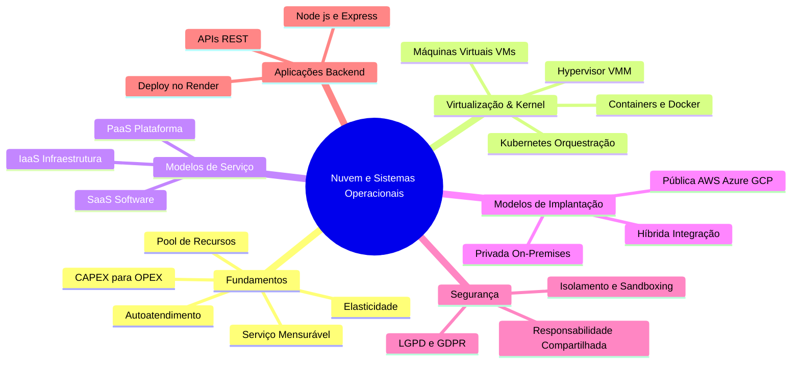
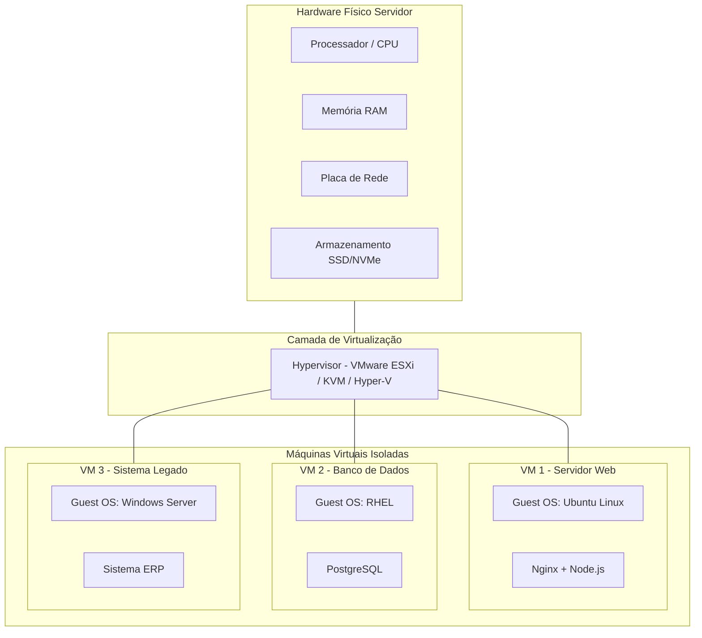
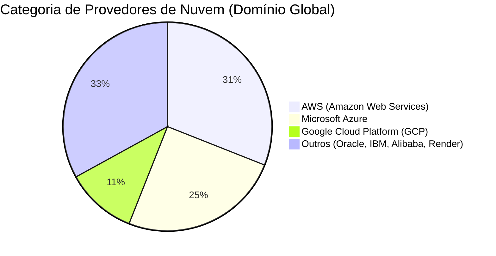
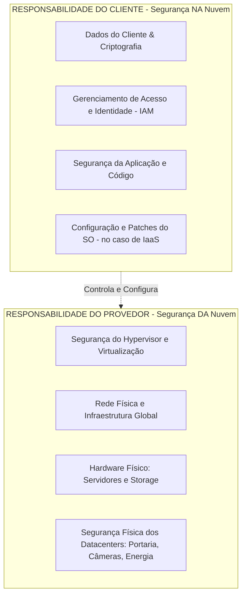

# ☁️ Nuvem e Sistemas Operacionais

**Instituição:** Fatec - Faculdade de Tecnologia  
**Disciplina:** Sistemas Operacionais  
**Professor:** Prof. Me. Deivison S. Takatu ([deivison.takatu@fatec.sp.gov.br](mailto:deivison.takatu@fatec.sp.gov.br))  

---

## 📌 Sumário

1. [Fundamentos da Computação em Nuvem](#-1-fundamentos-da-computação-em-nuvem)
2. [Mapa Mental: Nuvem & Sistemas Operacionais](#-2-mapa-mental-nuvem--sistemas-operacionais)
3. [Virtualização e Recursos sob Demanda](#-3-virtualização-e-recursos-sob-demanda)
4. [Modelos de Serviço (IaaS, PaaS, SaaS)](#-4-modelos-de-serviço-iaas-paas-saas)
5. [Modelos de Implantação e Provedores](#-5-modelos-de-implantação-e-provedores)
6. [Segurança e Modelo de Responsabilidade Compartilhada](#-6-segurança-e-modelo-de-responsabilidade-compartilhada)
7. [Containers, Microsserviços e Cloud-Native](#-7-containers-microsserviços-e-cloud-native)
8. [Prática: API REST com Express.js e Deploy no Render](#-8-prática-api-rest-com-expressjs-e-deploy-no-render)
9. [Tabelas Comparativas Resumidas](#-9-tabelas-comparativas-resumidas)
10. [Roteiro de Atividades Práticas](#-10-roteiro-de-atividades-práticas)
11. [Referências Bibliográficas](#-11-referências-bibliográficas)

---

## 🌩️ 1. Fundamentos da Computação em Nuvem

A **Computação em Nuvem (Cloud Computing)** representa uma mudança de paradigma essencial na forma como recursos computacionais são provisionados, gerenciados e consumidos. 

Segundo a definição padrão do **NIST** (*National Institute of Standards and Technology - SP 800-145*), a nuvem é composta por **5 características fundamentais**:

```
+-----------------------------------------------------------------------+
|                      5 CARACTERÍSTICAS NIST                           |
+-----------------------------------------------------------------------+
|  1. Autoatendimento Sob Demanda (On-demand Self-service)             |
|  2. Amplo Acesso à Rede (Broad Network Access)                        |
|  3. Pool de Recursos Compartilhados (Resource Pooling - Multi-tenant) |
|  4. Rápida Elasticidade (Rapid Elasticity)                            |
|  5. Serviço Mensurável (Measured Service / Pay-per-use)               |
+-----------------------------------------------------------------------+
```

### 💸 A Mudança Financeira: CAPEX vs. OPEX

A migração do Datacenter tradicional (*On-Premises*) para a Nuvem altera fundamentalmente a gestão financeira e operacional das empresas:

* **CAPEX (*Capital Expenditure* - Investimento em Capital):** Compra antecipada de ativos físicos (servidores, Racks, switches, no-breaks). Alto custo inicial e risco de ociosidade ou depreciação.
* **OPEX (*Operational Expenditure* - Despesas Operacionais):** Pagamento recorrente apenas pelo uso sob demanda. Custos proporcionais ao consumo imediato (*pay-as-you-go*).

---

## 🧠 2. Mapa Mental: Nuvem & Sistemas Operacionais



---

## 🏗️ 3. Virtualização e Recursos sob Demanda

O **Sistema Operacional** é a camada de abstração que possibilita a existência da nuvem. Através da **virtualização**, um único servidor físico pode rodar múltiplos SOs isolados simultaneamente.

### 🔌 O Papel do Hypervisor (VMM)

O **Hypervisor** (ou *Virtual Machine Monitor*) é o software responsável por intermediar o acesso das Máquinas Virtuais (VMs) ao hardware físico subjacente (CPU, RAM, Disco e Rede).



### 📈 Alta Disponibilidade e Escalonamento em Nuvem

Para garantir resiliência e evitar pontos únicos de falha (*Single Point of Failure*), os provedores utilizam estratégias arquiteturais avançadas:

1. 🏰 **Zonas de Disponibilidade (AZs):** Datacenters fisicamente isolados em uma mesma região, com fontes de energia, refrigeração e rede independentes.
2. ⚖️ **Balanceamento de Carga (*Load Balancing*):** Distribuição inteligente do tráfego entre múltiplas instâncias do sistema.
3. 🔄 **Replicação de Dados:** Sincronização automática de dados entre diferentes AZs.
4. ⚡ **Failover Automático:** Redirecionamento instantâneo de requisições caso uma instância ou zona apresente falhas.

---

## 📦 4. Modelos de Serviço (IaaS, PaaS, SaaS)

A computação em nuvem organiza seus serviços em camadas de responsabilidade e abstração:

```
+-------------------------------------------------------------------+
|                        SaaS (Software)                            |
|  (Aplicações prontas: Google Workspace, Microsoft 365, Slack)     |
+-------------------------------------------------------------------+
|                        PaaS (Plataforma)                          |
|  (Ambiente de execução: Render, Heroku, AWS Elastic Beanstalk)    |
+-------------------------------------------------------------------+
|                       IaaS (Infraestrutura)                       |
|  (Recursos brutos: AWS EC2, Google Compute Engine, Azure VMs)     |
+-------------------------------------------------------------------+
```

### 🏛️ Detalhamento dos Modelos

* **IaaS (*Infrastructure as a Service*):**
  * **Provedor entrega:** Servidores virtuais, armazenamento, roteadores e rede.
  * **Cliente gerencia:** Sistema Operacional, atualizações, middleware, runtime e aplicação.
  * **Exemplos:** AWS EC2, Google Compute Engine, Azure Virtual Machines.

* **PaaS (*Platform as a Service*):**
  * **Provedor entrega:** Infraestrutura física, SO, gerenciamento de patches, runtime e banco de dados.
  * **Cliente gerencia:** Apenas o código da aplicação e suas configurações.
  * **Exemplos:** Render, Heroku, AWS Elastic Beanstalk, Google App Engine.

* **SaaS (*Software as a Service*):**
  * **Provedor entrega:** O produto de software completo e funcional via internet/navegador.
  * **Cliente gerencia:** Usuários, permissões e configurações de uso do software.
  * **Exemplos:** Google Workspace, Microsoft 365, Salesforce, Zoom.

---

## 🌐 5. Modelos de Implantação e Provedores

### 🏛️ Modelos de Implantação

| Modelo | Descrição | Principais Casos de Uso |
| :--- | :--- | :--- |
| **Nuvem Pública** (*Public Cloud*) | Infraestrutura compartilhada (*multi-tenant*) operada por um provedor global via internet. | Startups, aplicações web escaláveis, sistemas gerais. |
| **Nuvem Privada** (*Private Cloud*) | Infraestrutura dedicada exclusivamente a uma única organização (*single-tenant*). | Bancos, governos, órgãos com severas restrições regulatórias. |
| **Nuvem Híbrida** (*Hybrid Cloud*) | Combinação entre nuvem privada e pública com orquestração de dados entre elas. | Empresas que mantêm dados sensíveis no local e usam a nuvem pública para surtos de demanda (*cloud bursting*). |

### 🌍 Principais Provedores no Mercado



---

## 🛡️ 6. Segurança e Modelo de Responsabilidade Compartilhada

A segurança em ambientes de nuvem é dividida claramente entre o provedor e o cliente através do **Modelo de Responsabilidade Compartilhada**:



> ⚠️ **Importante:** A nuvem é altamente segura em termos de infraestrutura, mas configurações incorretas por parte do cliente (ex: buckets de armazenamento expostos sem senha) são a principal causa de vazamentos de dados.

---

## 🐳 7. Containers, Microsserviços e Cloud-Native

Enquanto a **virtualização tradicional** cria máquinas virtuais completas com seus próprios SOs convidados, os **containers** utilizam a virtualização a nível de Sistema Operacional.

### ⚖️ Máquinas Virtuais vs. Containers

```
+-----------------------------------+     +-----------------------------------+
|   App A   |   App B   |   App C   |     |   App A   |   App B   |   App C   |
| (Libs/Bin)| (Libs/Bin)| (Libs/Bin)|     | (Libs/Bin)| (Libs/Bin)| (Libs/Bin)|
+-----------+-----------+-----------+     +-----------------------------------+
| Guest OS  | Guest OS  | Guest OS  |     |        Container Engine           |
+-----------+-----------+-----------+     |            (Docker)               |
|            Hypervisor             |     +-----------------------------------+
+-----------------------------------+     |     Host OS (Kernel Compartilhado)|
|          Hardware Físico          |     +-----------------------------------+
|        MÁQUINAS VIRTUAIS (VMs)    |     |          Hardware Físico          |
+-----------------------------------+     |            CONTAINERS             |
                                          +-----------------------------------+
```

* **Docker:** Tecnologia padrão para empacotamento e execução de aplicações em containers isolados.
* **Kubernetes (K8s):** Plataforma para orquestração, automação e escalonamento de milhares de containers em produção.

---

## 🛠️ 8. Prática: API REST com Express.js e Deploy no Render

Abaixo está o código-fonte de um servidor backend desenvolvido em **Node.js** com **Express.js** capaz de ler e retornar dados do Sistema Operacional hospedeiro.

### 💻 Código do Projeto: `cloud-so-app/index.js`

```javascript
const express = require('express');
const cors = require('cors');
const os = require('os');

const app = express();
const PORT = process.env.PORT || 3000;

// Habilita requisições cross-origin (CORS)
app.use(cors());
app.use(express.json());

// Rota raiz - Mensagem de Boas-Vindas
app.get('/', (req, res) => {
  res.send(`
    <h1>☁️ Aplicação Nuvem & Sistemas Operacionais</h1>
    <p>Acesse a rota <code>/api/so</code> para visualizar métricas em tempo real do Sistema Operacional.</p>
  `);
});

// Rota técnica - Informações do Sistema Operacional
app.get('/api/so', (req, res) => {
  const totalMemGB = (os.totalmem() / (1024 ** 3)).toFixed(2);
  const freeMemGB = (os.freemem() / (1024 ** 3)).toFixed(2);
  const usedMemGB = (totalMemGB - freeMemGB).toFixed(2);

  const infoSO = {
    hostname: os.hostname(),
    plataforma: os.platform(),
    arquitetura: os.arch(),
    versaoKernel: os.release(),
    processadores: {
      modelo: os.cpus()[0].model,
      quantidadeNucleos: os.cpus().length
    },
    memoria: {
      total: `${totalMemGB} GB`,
      livre: `${freeMemGB} GB`,
      emUso: `${usedMemGB} GB`
    },
    tempoAtividadeSegundos: os.uptime(),
    tempoAtividadeHoras: (os.uptime() / 3600).toFixed(2)
  };

  res.json(infoSO);
});

// Inicialização do Servidor
app.listen(PORT, () => {
  console.log(`🚀 Servidor rodando na porta ${PORT}`);
});
```

---

## 📊 9. Tabelas Comparativas Resumidas

### 🔄 IaaS vs. PaaS vs. SaaS

| Critério | IaaS | PaaS | SaaS |
| :--- | :--- | :--- | :--- |
| **Nível de Abstração** | Baixo (Acesso ao SO) | Médio (Ambiente de Execução) | Alto (Aplicação Pronta) |
| **O que você gerencia** | SO, Runtime, Dados e Aplicação | Apenas Código e Dados | Nada (Apenas Uso) |
| **Complexidade** | Alta | Média | Baixa |
| **Exemplo Principal** | AWS EC2 | Render / Heroku | Google Workspace |

### 🖥️ Execução Local vs. Execução em Nuvem (Render)

| Métrica / Recurso | Ambiente Local (Sua Máquina) | Ambiente Cloud (Render) |
| :--- | :--- | :--- |
| **Sistema Operacional** | Windows 10/11 ou macOS | Linux (Ubuntu/Debian Server) |
| **Arquitetura de CPU** | x86_64 / ARM (Apple Silicon) | x86_64 (Virtualizado) |
| **Memória RAM Disponível** | Normal: 8 GB a 32 GB | Plano Grátis: ~512 MB |
| **Endereço de Acesso** | `localhost:3000` ou `127.0.0.1` | `https://seu-projeto.onrender.com` |
| **Gerenciamento de Processos** | Manual via Terminal/VS Code | Automático via Container do Render |

---

## 📝 10. Roteiro de Atividades Práticas

Siga as etapas abaixo para concluir o laboratório prático da disciplina:

```
[Etapa 1: Código] ──> [Etapa 2: Git/GitHub] ──> [Etapa 3: Deploy Render] ──> [Etapa 4: Análise]
```

### 📌 Passo a Passo Detalhado

1. **Desenvolvimento Local (`cloud-so-app`):**
   * Crie uma pasta para o projeto e execute `npm init -y`.
   * Instale as dependências com `npm install express cors`.
   * Crie o arquivo `index.js` utilizando o módulo `os` do Node.js.
   * Teste localmente executando `node index.js` e acesse `http://localhost:3000/api/so`.

2. **Versionamento e Publicação no GitHub:**
   * Crie um arquivo `.gitignore` e inclua a linha `node_modules`.
   * Inicialize o repositório Git, faça o commit e envie para o GitHub (`git push`).

3. **Deploy no Render (Cloud Service):**
   * Acesse [dashboard.render.com](https://dashboard.render.com).
   * Crie um novo **Web Service** conectado ao seu repositório do GitHub.
   * Defina os comandos:
     * **Build Command:** `npm install`
     * **Start Command:** `node index.js`
   * Aguarde a finalização do deploy e obtenha a URL pública gerada.

4. **Análise Comparativa e Documentação Técnica:**
   * Compare os dados da rota `/api/so` obtidos no seu computador com os dados retornados pela nuvem do Render.
   * Elabore um relatório em Markdown (`MANUAL.md`) explicando as diferenças encontradas e conectando aos conceitos de: **Kernel, Virtualização, Gerenciamento de Memória, Processos e Containers**.

---

## 📚 11. Referências Bibliográficas

* TANENBAUM, Andrew S.; BOS, Herbert. **Sistemas Operacionais Modernos**. 4. ed. São Paulo: Pearson, 2016.
* SILBERSCHATZ, Abraham; GALVIN, Peter B.; GAGNE, Greg. **Fundamentos de Sistemas Operacionais**. 9. ed. Rio de Janeiro: LTC, 2015.
* NIST. **The NIST Definition of Cloud Computing (SP 800-145)**. National Institute of Standards and Technology, 2011.
* RED HAT. **What is Cloud-Native?** Documentação Técnica e Guias Oficiais.
* DOCKER INC. **Docker Overview and Architecture Documentation**. Disponível em: [https://docs.docker.com](https://docs.docker.com?utm_source=gemini).
