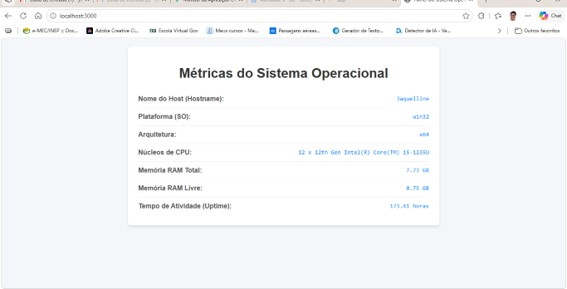
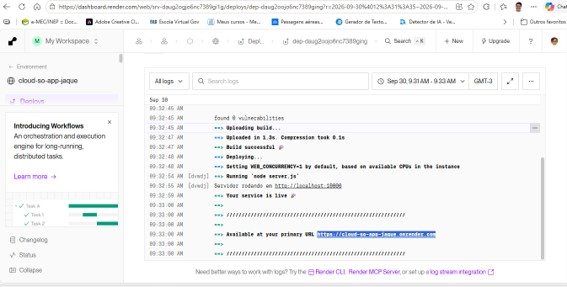
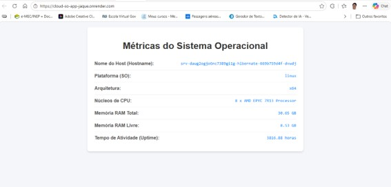

# 📖 Manual de Desenvolvimento, Publicação e Análise de Sistemas Operacionais

**Aplicação:** `cloud-so-app`  
**Autora:** Jaquelline (`jaquellinef`)  
**Repositório:** [github.com/jaquellinef/cloud-so-app](https://github.com/jaquellinef/cloud-so-app)  
**Ambiente Cloud (Render):** [cloud-so-app-jaque.onrender.com](https://cloud-so-app-jaque.onrender.com)  

---

## 1. Introdução

Este manual documenta o ciclo de vida completo de desenvolvimento, teste local, hospedagem em nuvem e análise conceitual de Sistemas Operacionais da aplicação web **`cloud-so-app`**. A aplicação foi desenvolvida em JavaScript/Node.js utilizando o framework **Express.js** e o módulo nativo **`os`**, permitindo consultar e exibir métricas em tempo real do sistema operacional sob o qual a aplicação está sendo executada.

---

## 2. Instalação das Ferramentas e Pré-requisitos

Para a execução deste projeto, foram instaladas e configuradas as seguintes ferramentas:

1. **Node.js (v24.x LTS / npm):**
   * Ambiente de execução para código JavaScript fora do navegador.
   * *Verificação no terminal:* `node -v` e `npm -v`.

2. **Git:**
   * Sistema de controle de versão distribuído para rastreamento e envio do código-fonte.
   * *Verificação no terminal:* `git --version`.

3. **Visual Studio Code (VS Code):**
   * Editor de código-fonte utilizado para a escrita, organização de arquivos e execução de comandos pelo terminal integrado.

---

## 3. Criação do Projeto e Desenvolvimento da Aplicação

### 3.1. Estrutura de Arquivos

O projeto foi estruturado na pasta `cloud-so-app` com os seguintes arquivos essenciais:

```text
cloud-so-app/
├── node_modules/        # Dependências instaladas (Express)
├── .gitignore          # Arquivo para ignorar a pasta node_modules no Git
├── package.json        # Arquivo de manifesto e scripts do Node.js
├── package-lock.json   # Mapeamento exato de versões das dependências
├── server.js           # Código-fonte principal da aplicação
├── MANUAL.md           # Manual e relatório de SO
└── metrica_jaque.jpg   # Captura de tela do teste local
└── metrica_render.jpg  # Captura de tela do teste na nuvem
└── tela_render.jpg     # Captura de tela do painel do Render
```

### 3.2. Inicialização e Instalação do Framework

No terminal integrado do VS Code, o projeto foi inicializado e o Express instalado com os comandos:

```bash
npm init -y
npm install express
```

### 3.3. Configuração do `.gitignore`

Foi criado o arquivo `.gitignore` contendo a instrução abaixo para impedir o envio de arquivos pesados e desnecessários ao repositório remoto:

```text
node_modules
```

### 3.4. Código-Fonte (`server.js`)

O arquivo `server.js` importa o módulo nativo `os` para coletar dados do hardware/SO e o módulo `express` para servir a página web na porta atribuída dinamicamente (`process.env.PORT || 3000`).

```javascript
const express = require('express');
const os = require('os');

const app = express();
const PORT = process.env.PORT || 3000;

app.get('/', (req, res) => {
    // Coleta de métricas do sistema operacional via módulo 'os'
    const hostname = os.hostname();
    const platform = os.platform();
    const arch = os.arch();
    const cpus = os.cpus();
    const totalMemory = (os.totalmem() / (1024 ** 3)).toFixed(2); // Conversão para GB
    const freeMemory = (os.freemem() / (1024 ** 3)).toFixed(2);   // Conversão para GB
    const uptimeHours = (os.uptime() / 3600).toFixed(2);         // Conversão para Horas

    // Interface visual responsiva
    const htmlContent = `
    <!DOCTYPE html>
    <html lang="pt-BR">
    <head>
        <meta charset="UTF-8">
        <meta name="viewport" content="width=device-width, initial-scale=1.0">
        <title>Painel do Sistema Operacional - cloud-so-app</title>
        <style>
            body { font-family: 'Segoe UI', Tahoma, Geneva, Verdana, sans-serif; background-color: #f0f2f5; margin: 0; padding: 30px; }
            .card { max-width: 650px; margin: 0 auto; background: #ffffff; padding: 30px; border-radius: 12px; box-shadow: 0 4px 12px rgba(0,0,0,0.1); }
            h1 { color: #1a73e8; text-align: center; margin-bottom: 25px; border-bottom: 2px solid #e8eaed; padding-bottom: 10px; }
            .metric { display: flex; justify-content: space-between; padding: 12px 0; border-bottom: 1px solid #f1f3f4; }
            .metric:last-child { border-bottom: none; }
            .label { font-weight: 600; color: #3c4043; }
            .value { color: #1a73e8; font-family: 'Courier New', Courier, monospace; font-weight: bold; }
        </style>
    </head>
    <body>
        <div class="card">
            <h1>Métricas do Sistema Operacional</h1>
            <div class="metric"><span class="label">Nome do Host (Hostname):</span> <span class="value">${hostname}</span></div>
            <div class="metric"><span class="label">Plataforma (SO):</span> <span class="value">${platform}</span></div>
            <div class="metric"><span class="label">Arquitetura:</span> <span class="value">${arch}</span></div>
            <div class="metric"><span class="label">Núcleos de CPU:</span> <span class="value">${cpus.length} x ${cpus[0]?.model || 'Desconhecido'}</span></div>
            <div class="metric"><span class="label">Memória RAM Total:</span> <span class="value">${totalMemory} GB</span></div>
            <div class="metric"><span class="label">Memória RAM Livre:</span> <span class="value">${freeMemory} GB</span></div>
            <div class="metric"><span class="label">Tempo de Atividade (Uptime):</span> <span class="value">${uptimeHours} horas</span></div>
        </div>
    </body>
    </html>
    `;

    res.send(htmlContent);
});

app.listen(PORT, () => {
    console.log(`Servidor rodando em http://localhost:${PORT}`);
});
```

---

## 4. Teste Local e Solução de Problemas

1. **Execução:** No terminal do VS Code, a aplicação foi iniciada com o comando `node server.js`.
2. **Acesso:** Abrindo o navegador no endereço `http://localhost:3000`, a página renderizou com sucesso as informações do hardware do computador local.
3. **Resolução do erro de extensão (`MODULE_NOT_FOUND`):** O Windows salvou o arquivo como `server.js.txt` inicialmente. O arquivo foi ajustado para `server.js` na raiz do projeto para garantir a localização do módulo de entrada pelo runtime do Node.js.

  
*Figura 1: Execução local da aplicação em ambiente Windows (localhost:3000).*

---

## 5. Versionamento (GitHub) e Publicação na Nuvem (Render)

### 5.1. Envio para o GitHub

Os comandos de versionamento utilizados foram:

```bash
git init
git add .
git commit -m "Primeiro commit da aplicacao cloud-so-app"
git branch -M main
git remote add origin https://github.com/jaquellinef/cloud-so-app.git
git push -u origin main
```

*Nota de solução de erro:* Para contornar a restrição de privacidade do e-mail do GitHub (`GH007: Your push would publish a private email address`), a opção de bloqueio de envios por linha de comando foi ajustada nas configurações da conta (`settings/emails`), permitindo a conclusão do *push*.

### 5.2. Hospedagem no Render

1. Autenticação via GitHub realizada no painel do Render.
2. Criação de um novo **Web Service** vinculado ao repositório `cloud-so-app`.
3. Configurações aplicadas:
   * **Runtime / Language:** `Node`
   * **Build Command:** `npm install`
   * **Start Command:** `node server.js`
   * **Instance Type:** `Free`
4. Implantação efetuada com sucesso, gerando o link público da aplicação: `https://cloud-so-app-jaque.onrender.com`.

  
*Figura 2: Dashboard do Render confirmando o build, deploy e a URL pública ativa (`Your service is live`).*

---

## 6. Análise Comparativa: Ambiente Local vs. Ambiente Cloud

Abaixo está a comparação detalhada coletada diretamente da execução nos dois ambientes:

| Métrica do Sistema | Execução Local (Máquina Física) | Execução na Nuvem (Render / Cloud) |
| :--- | :--- | :--- |
| **Hostname** | `Jaquelline` | `srv-daug2ogjo0nc7389gi1g-hibernate-66b759d4f-dnwdj` |
| **Plataforma (SO)** | `win32` (Windows) | `linux` (Linux Server) |
| **Arquitetura** | `x64` | `x64` |
| **Núcleos de CPU** | `12 x 12th Gen Intel(R) Core(TM) i5-1235U` | `8 x AMD EPYC 7R13 Processor` |
| **Memória RAM Total** | `7.73 GB` | `30.05 GB` |
| **Memória RAM Livre** | `0.75 GB` | `8.53 GB` |
| **Uptime (Atividade)**| `173.41 horas` (~7,2 dias) | `3816.88 horas` (~159 dias) |

  
*Figura 3: Execução na nuvem (Render) sob sistema Linux e hardware virtualizado.*

---

## 7. Aplicação Prática dos Conceitos de Sistemas Operacionais

1. **Processos e TCB/PCB:**  
   Ao executar `node server.js`, o SO aloca recursos na memória, associa um **PID (Process ID)** e cria o **PCB (Process Control Block)** para acompanhar o estado do processo.

2. **Gerenciamento de Memória e Syscalls:**  
   As chamadas `os.freemem()` e `os.totalmem()` acionam chamadas de sistema (*system calls*) para solicitar ao Kernel os dados de alocação de memória física e virtual.

3. **Uso de CPU e Escalonamento:**  
   A aplicação roda no espaço do usuário (*User Space*), enquanto o **Escalonador (Scheduler)** do Kernel decide como os threads do Node.js compartilham o processador (Intel Core i5 no ambiente local e AMD EPYC na nuvem).

4. **Virtualização e Containers:**  
   No Render, o ambiente executa dentro de um container isolado Linux. O *hostname* gerado (`srv-daug...`) é um ID do container e as especificações de hardware refletem o nó do cluster do provedor de nuvem.

5. **Computação em Nuvem (Cloud Computing):**  
   Permite a distribuição automatizada da aplicação via integração contínua (CI/CD) com o GitHub, garantindo que o serviço permaneça acessível via HTTP de qualquer lugar do mundo.

---

## 8. Conclusões Finais

A atividade prática permitiu vivenciar o ciclo completo de desenvolvimento e implantação de uma aplicação web consultando diretamente recursos do SO. A comparação entre os dois ambientes evidenciou a abstração promovida pelos **Containers e pela Virtualização**: enquanto a execução local dependia do sistema de arquivos e hardware do ecossistema Windows, a execução em nuvem operou de forma transparente sob um ambiente hospedeiro Linux de alto desempenho.

---
