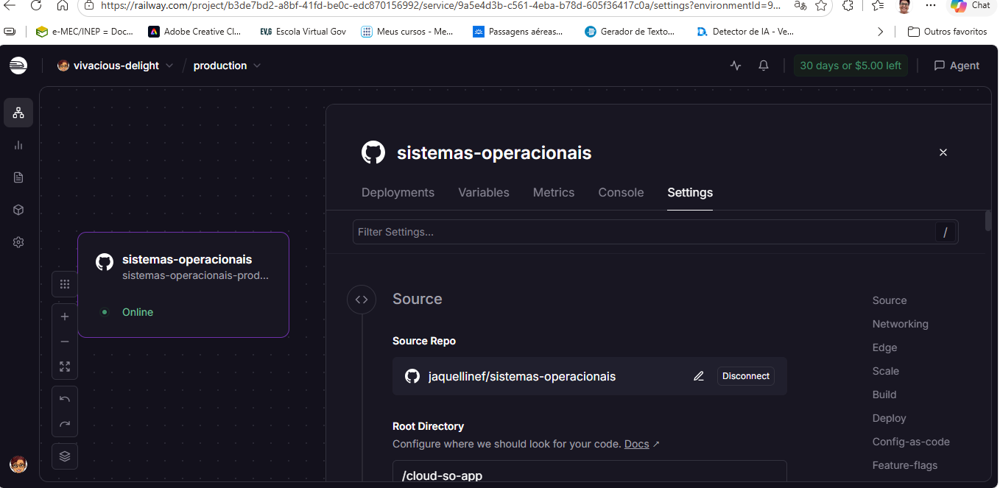

# Relatório de Implantação e Monitoramento de SO em Ambiente Cloud (PaaS)

## 1. Visão Geral do Projeto

Este documento apresenta o relatório detalhado de implantação e monitoramento da aplicação **`cloud-so-app` (Atividade 7)**. A aplicação foi desenvolvida para coletar e exibir métricas em tempo real do Sistema Operacional e Hardware dos servidores onde está hospedada.

O projeto foi publicado e testado em duas plataformas de Plataforma como Serviço (**PaaS**):
- **Railway**
- **Render**

---

## 2. Implantação na Plataforma Railway

### 2.1 Configuração do Repositório e Conectividade
A integração da aplicação no Railway foi realizada através do vínculo direto com o repositório hospedado no GitHub.

- **Repositório Origem:** `jaquellinef/sistemas-operacionais`
- **Diretório Raiz (Root Directory):** `/cloud-so-app`
- **Status do Serviço:** Online

### 2.2 Configurações de Rede (Networking & Public Domains)
Para permitir o acesso público ao painel de monitoramento, foram gerados domínios HTTPS públicos associados à porta interna `8080` do contêiner.

- **Domínio Principal:** `sistemas-operacionais-production.up.railway.app`
- **Porta do Repositório:** `8080`

### 2.3 Painel de Monitoramento Executivo (Railway)
O painel exibe o desempenho e os recursos alocados para o contêiner no ambiente do Railway:

- **Sistema Operacional:** Linux (`5f456ede1912`)
- **Processador (CPU):** AMD EPYC 9655 96-Core Processor
- **Núcleos Totais (vCPUs):** 48 Núcleos
- **Memória RAM Total:** 322.69 GB
- **RAM em Uso:** 233.36 GB (72.3%)
- **Tempo Ligado (Uptime):** 151 dias, 6 horas, 36 minutos
- **IP Principal:** `10.243.38.50`

---

## 3. Implantação na Plataforma Render

### 3.1 Execução e Métricas no Render
A aplicação também foi disponibilizada no provedor Render sob a URL `https://cloud-so-app-6elo.onrender.com`.

#### Painel de Status - Sessão 1
Na primeira captura de análise, verificam-se os seguintes parâmetros:
- **Modelo de CPU:** AMD EPYC 7R13 Processor (8 vCPUs)
- **Versão do Kernel:** `7.0.0-1009-aws`
- **Versão do Node.js:** `v24.21.0`
- **Uso de RAM:** 18.79 GB / 30.65 GB (61.3%)
- **Tempo Ligado (Uptime):** 4 dias, 2 horas, 14 minutos

#### Painel de Status - Sessão 2
Em uma análise posterior de estresse/monitoramento contínuo:
- **Status Geral:** EXCELENTE
- **Uso de RAM:** 21.24 GB / 30.65 GB (69.3%)
- **Tempo Ligado (Uptime):** 53 dias, 5 horas, 10 minutos
- **Armazenamento:** 67.45 GB de espaço livre em disco (82.6% Usado)

---

## 4. Comparativo dos Ambientes Cloud PaaS

| Métrica / Parâmetro | Railway (Cloud PaaS) | Render (Cloud PaaS) |
| :--- | :--- | :--- |
| **Hostname da Máquina** | `5f456ede1912` | `srv-db2ff9jtqb8s73d7hp70-hibernat...` |
| **Arquitetura / SO** | Linux (x64) | Linux (x64) |
| **Modelo da CPU** | AMD EPYC 9655 96-Core | AMD EPYC 7R13 |
| **vCPUs Disponíveis** | 48 Núcleos | 8 Núcleos |
| **Memória RAM Total** | 322.69 GB | 30.65 GB |
| **Gerenciamento de Memória** | V8 Garbage Collection | V8 Garbage Collection |
| **Isolamento de Processos** | Contêiner LXC / Docker | Contêiner LXC / Docker |

---

## 5. Conclusão

A aplicação **`cloud-so-app`** demonstrou total compatibilidade em ambos os ambientes PaaS testados:
1. **Railway:** Apresentou uma infraestrutura robusta com suporte a instâncias multicore avançadas (48 vCPUs e 322 GB de RAM no host containerizado).
2. **Render:** Ofereceu estabilidade contínua, mantendo o uptime do serviço em níveis adequados e fornecendo métricas precisas sobre o ecossistema Node.js e kernel AWS Linux.